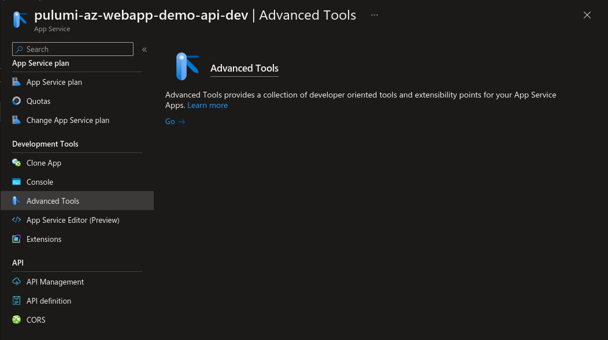
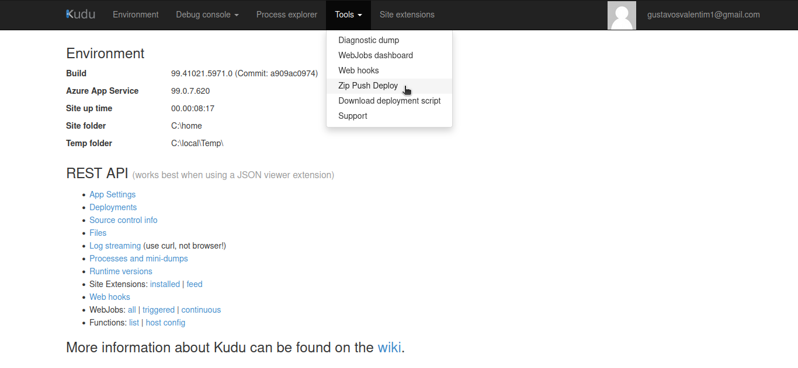

# pulumi-az-webapp-demo

## Dependencies

- [Pulumi]()
- [Azure CLI]()
- [NodeJS]()

## Create cloud resources

Create pulumi stack

`pulumi stack init dev`

Preview changes

`pulumi preview`

Create resources in the stack

`pulumi up`

## Deploy

Zip the contents of `src` folder.

Go to your app service at [Azure Portal](https://portal.azure.com) and open advanced tools.



At the advanced tools page navigate to `Tools` > `Zip Push Deploy`.



Just drag the file and drop at the web page.

> After a few tests I noticed zip deploy only works when the following value is added to `SiteConfigArgs.appSettings`

```javascript
const appService = new web.WebApp(..., {
    ...
    appSettings: {
        {
            name: "SCM_DO_BUILD_DURING_DEPLOYMENT",
            value: "true",
        },
    };
});
```

## References

[Azure - deploy zip](https://learn.microsoft.com/en-us/azure/app-service/deploy-zip?tabs=cli)
[Pulumi example appservice](https://www.pulumi.com/registry/packages/azure-native/how-to-guides/azure-ts-appservice/)
